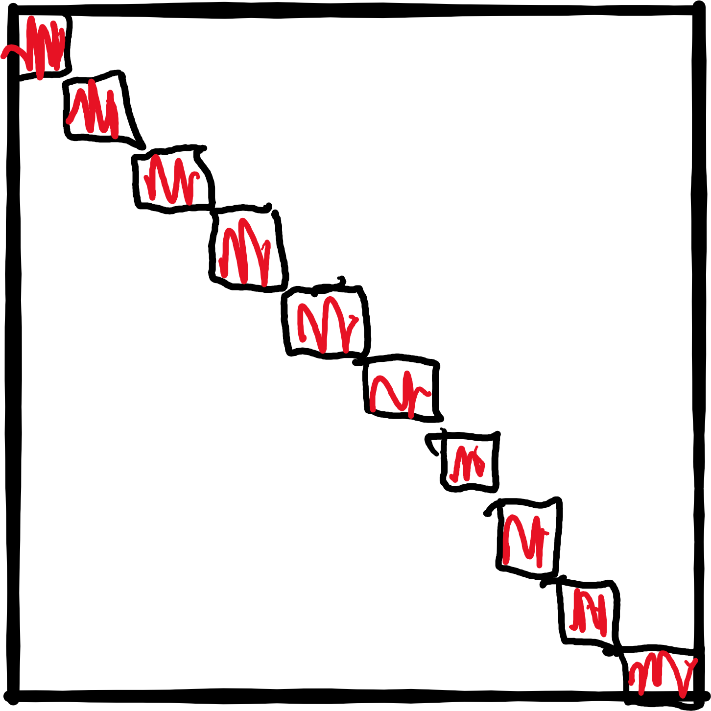
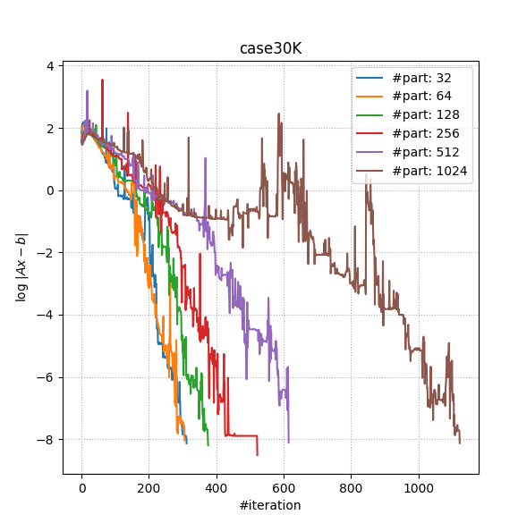

# Summary

Solving optimal power flow is an important tool in the secure and cost
effective operation of the transmission power grids. `ExaPF.jl` aims to
implement a reduced method for solving the optimal power flow problem (OPF)
fully on GPUs. Reduced methods enforce the constraints, represented here by
the power flow's (PF) system of nonlinear equations, separately at each
iteration of the optimization in the reduced space. This paper describes the
API of `ExaPF.jl` for solving the power flow's nonlinear equations entirely on the GPU.
This includes the computation of the derivatives using automatic
differentiation, an iterative linear solver with a preconditioner, and a
Newton-Raphson implementation. All of these steps allow us to run the main
computational loop entirely on the GPU with no transfer from host to device.

This implementation will serve as the basis for the future OPF implementation
in the reduced space.

# Statement of Need

The current state-of-the-art for solving optimal power flow is the
interior-point method (IPM) in optimization implemented by the solver Ipopt
[@wachter2004implementation] and is the algorithm of reference
implementations like MATPOWER [@matpower]. However, its reliance on
unstructured sparse indefinite inertia revealing direct linear solvers makes
this algorithm hard to port to GPUs. `ExaPF.jl` aims at applying a reduced
gradient method to tackle this problem, which allows us to leverage iterative
linear solvers for solving the PF.

Our final goal is a reduced method optimization solver that provides a
flexible API for models and formulations outside of the domain of OPF.

# Components

To make our implementation portable to CPU and GPU architectures we leverage
two abstractions: arrays and kernels. Both of these abstractions are
supported through the packages `CUDA.jl` [@besard2018juliagpu; @besard2019prototyping] and `KernelAbstractions.jl`

## AutoDiff

Given a set of equations `F(x) = 0`, the Newton-Raphson algorithm for
solving nonlinear equations (see below) requires the Jacobian `J = jacobian(x)`
of `F`. At each iteration a new step `dx` is computed by
solving a linear system. In our case `J` is sparse and indefinite.

```julia
  go = true
  while(go)
    dx .= jacobian(x)\F(x)
    x  .= x .- dx
    go = norm(f(x)) < tol ? true : false
  end
```
There are two modes of differentiation called *forward/tangent* or
*reverse/adjoint*. The latter is known in machine learning as
*backpropagation*. The forward mode generates Jacobian-vector product code
`tgt(x,d) = J(x) * d`, while the adjoint mode generates code for the
transposed Jacobian-vector product `adj(x,y) = (J(x)'*y)`. We recommend
@griewank2008evaluating for a more in-depth introduction to automatic
differentiation. The computational complexity of both models favors the
adjoint mode if the number of outputs of `F` is much smaller than the
number of inputs `size(x) >> size(F)`, like for example the loss functions
in machine learning. However, in our case `F` is a multivariate vector
function from $\mathbb{R}^n$ to $\mathbb{R}^n$, where $n$ is the number of
buses.
\newcommand{\bigo}[1]{\mathcal{O}\left( #1 \right)}


To avoid a complexity of $\bigo{n} \cdot cost(F)$ by letting the tangent mode
run over all Cartesian basis vectors of $\mathbb{R}^n$, we apply the technique of Jacobian
coloring to compress the sparse Jacobian `J`. Running the tangent mode, it
allows to compute columns of the Jacobian concurrently, by combining
independent columns in one Jacobian-vector evaluation (see
\autoref{fig:coloring}). For sparsity detection we rely on the greedy
algorithm implemented by `SparseDiffTools.jl`
[@sparsedifftools].

Given the sparsity pattern, the forward model is applied through the package
`ForwardDiff.jl` [@RevelsLubinPapamarkou2016]. Given the number of Jacobian
colors $c$ we can build our dual type `t1s` with `c` directions:

```julia
t1s{N} = ForwardDiff.Dual{Nothing,Float64, N} where N}
```
Note that a second-order type `t2s` can be created naturally by applying the same logic to `t1s`:

```julia
t2s{M,N} =  ForwardDiff.Dual{Nothing,t1s{N}, M} where M, N}
```

Finally, this dual type can be ported to both vector types `Vector` and `CuVector`:

```julia
T = Vector{Float64}
T = Vector{t1s{N}}}
T = CuVector{t1s{N}}}
```

Setting `T` to either of the three types allows us to instantiate code that has been written using the *broadcast operator* `.`

```julia
x .= a .* b
```

or accessed in kernels written for `KernelAbstractions.jl` like for example the power flow equations (here in polar form):

```julia
@kernel function residual_kernel!(F, v_m, v_a,
                                  ybus_re_nzval, ybus_re_colptr, ybus_re_rowval,
                                  ybus_im_nzval, ybus_im_colptr, ybus_im_rowval,
                                  pinj, qinj, pv, pq, nbus)

    npv = size(pv, 1)
    npq = size(pq, 1)

    i = @index(Global, Linear)
    # REAL PV: 1:npv
    # REAL PQ: (npv+1:npv+npq)
    # IMAG PQ: (npv+npq+1:npv+2npq)
    fr = (i <= npv) ? pv[i] : pq[i - npv]
    F[i] -= pinj[fr]
    if i > npv
        F[i + npq] -= qinj[fr]
    end
    @inbounds for c in ybus_re_colptr[fr]:ybus_re_colptr[fr+1]-1
        to = ybus_re_rowval[c]
        aij = v_a[fr] - v_a[to]
        coef_cos = v_m[fr]*v_m[to]*ybus_re_nzval[c]
        coef_sin = v_m[fr]*v_m[to]*ybus_im_nzval[c]
        cos_val = cos(aij)
        sin_val = sin(aij)
        F[i] += coef_cos * cos_val + coef_sin * sin_val
        if i > npv
            F[npq + i] += coef_cos * sin_val - coef_sin * cos_val
        end
    end
end
```

These two abstractions are a powerful tool that allow us to implement the
forward mode in vectorized form where the number of directions or tangent
components of a tangent variable are the number of Jacobian colors. We
illustrate this in \autoref{fig:simd} with a point-wise vector product `x .* y`


This natural way of computing the compressed Jacobian yields a very high
performing code that is portable to any vector architecture, given that a
similar package like `CUDA.jl` exists. We note that similar packages for the
Intel Compute Engine and AMD ROCm are in development called `oneAPI.jl` and
`AMDGPU.jl`, respectively. We expect our package to be portable to AMD and
Intel GPUs in the future.

## Linear Solver

As mentioned before, a linear solver is required to compute the Newton step in

```julia
dx .= jacobian(x)\F(x)
```

Our package supports the following linear solvers:

* CUSOLVER with `csrlsvqr` (GPU),
* `Krylov.jl` with `dqgmres` (CPU/GPU),
* `IterativeSolvers` with `bicgstab` (CPU) [@sleijpen1993bicgstab],
* UMFPACK through the default Julia `\` operator (CPU),
* and a custom BiCGSTAB implementation [@bicgstabVorst] (CPU/GPU).

The last custom implementation was necessary as BiCGSTAB showed much better
performance than GMRES and at the time of this writing both `Krylov.jl` and
`IterativeSolvers.jl` did not provide an implementation that supported
`CUDA.jl`.

Using only an iterative solver leads to divergence and bad performance due to
ill-conditioning of the Jacobian. This is a known phenomenon in power
systems. That's why this package comes with a block Jacobi preconditioner
that is tailored towards GPUs and is proven to work well with power flow
problems.

The Jacobian is partitioned into a dense block diagonal structure, where each block is inverted to build our preconditioner `P`. For the partition we use `Metis.jl`.

{ width=150px }

Compared to incomplete Cholesky and incomplete LU this preconditioner is easily portable to the GPU if the number of blocks is high enough. `ExaPF.jl` uses the batch BLAS calls from `CUBLAS` to invert the single blocks.

```julia
CUDA.@sync pivot, info = CUDA.CUBLAS.getrf_batched!(blocks, true)
CUDA.@sync pivot, info, p.cuJs = CUDA.CUBLAS.getri_batched(blocks, pivot)
```

Assuming that other vendors will provide such batched BLAS APIs, this code is portable to other GPU architectures.

# Performance Example 

To get an impression of the use case for this solver we show a 30,000 bus system case from the ARPA-E GO competition.

{ width=300px }

Blocks      Block Size Time(s) Time/It.(s) #Iterations
------       ----------- ------- ----------- -----------
  32 1857   2.85e+00   9.07e-03   314
  64  928   1.41e+00   4.57e-03   308
 128  464   9.15e-01   2.42e-03   378
 256  232   9.09e-01   1.74e-03   524
 512  116   5.49e-01   8.90e-04   617
1024   58   7.50e-01   6.67e-04  1125

This shows the number of BiCGSTAB iterations and the time to convergence for this power system.

# Acknowledgments

This research was supported by the Exascale Computing Project (17-SC-20-SC), a joint project of the U.S. Department of Energy’s Office of Science and National Nuclear Security Administration, responsible for delivering a capable exascale ecosystem, including software, applications, and hardware technology, to support the nation’s exascale computing imperative.

# References
